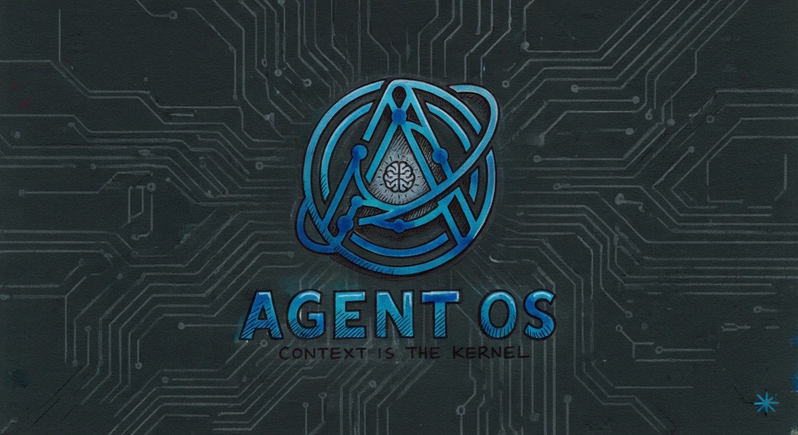

<!-- Improved compatibility of back to top link: See: https://github.com/othneildrew/Best-README-Template/pull/73 -->
<a id="readme-top"></a>

[![Contributors][contributors-shield]][contributors-url]
[![Forks][forks-shield]][forks-url]
[![Stargazers][stars-shield]][stars-url]
[![Issues][issues-shield]][issues-shield-url]
[![License][license-shield]][license-url]

<!-- PROJECT LOGO -->
<br />
<div align="center">
  <a href="https://codeberg.org/tylerdotai/agent-os">
    
  </a>

  <h3 align="center">Agent OS</h3>

  <p align="center">
    An operating system designed specifically for AI agents — with context as first-class citizens.
    <br />
    <a href="https://codeberg.org/tylerdotai/agent-os"><strong>Explore the docs »</strong></a>
    <br />
    <br />
    <a href="https://codeberg.org/tylerdotai/agent-os/issues">Report Bug</a>
    ·
    <a href="https://codeberg.org/tylerdotai/agent-os/issues">Request Feature</a>
  </p>
</div>

<!-- TABLE OF CONTENTS -->
<details>
  <summary>Table of Contents</summary>
  <ol>
    <li><a href="#about-the-project">About The Project</a></li>
    <li><a href="#why">Why</a></li>
    <li><a href="#architecture">Architecture</a></li>
    <li><a href="#getting-started">Getting Started</a></li>
    <li><a href="#roadmap">Roadmap</a></li>
    <li><a href="#contributing">Contributing</a></li>
    <li><a href="#license">License</a></li>
    <li><a href="#contact">Contact</a></li>
  </ol>
</details>

<!-- ABOUT THE PROJECT -->
## About The Project

Agent OS is a purpose-built operating system for AI agents. Unlike traditional operating systems that manage hardware resources for general-purpose computing, Agent OS manages **context**, **capabilities**, and **identity** for autonomous agents.

The core insight: **Context is the new RAM.**

Traditional OS: manage hardware → run processes → isolate them → give them filesystem/network
Agent OS: manage context + tools + identity → run thinking processes → isolate them → give them memory + actions

<p align="right">(<a href="#readme-top">back to top</a>)</p>

<!-- WHY -->
## Why

Current AI agents run on top of general-purpose operating systems. This is like running a server application on a desktop OS — it works, but it's the wrong abstraction.

**Problems we're solving:**
- Context window limits are handled ad-hoc (in-memory string manipulation)
- Tool access is inconsistent (different APIs for everything)
- Agent identity is tied to the human running them
- No native inter-agent communication (HTTP/REST is wrong)
- Agent state doesn't survive reboots (we hack together memory files)

**Agent OS treats these as kernel-level primitives.**

<p align="right">(<a href="#readme-top">back to top</a>)</p>

<!-- ARCHITECTURE -->
## Architecture

### Core Components

```
┌────────────────────────────────────────────────────────────┐
│                     Agent OS Userspace                      │
│  ┌──────────┐  ┌──────────┐  ┌──────────┐  ┌──────────┐ │
│  │ Context  │  │   Tool   │  │ Identity │  │  Message │  │
│  │ Manager  │  │ Registry │  │   Auth   │  │   Bus    │  │
│  └────┬─────┘  └────┬─────┘  └────┬─────┘  └────┬─────┘  │
│       │             │             │             │          │
│       └─────────────┴──────┬──────┴─────────────┘          │
│                            │                                │
│                    ┌───────┴───────┐                       │
│                    │   Kernel      │                       │
│                    │ (Persistence, │                       │
│                    │  Scheduling)   │                       │
│                    └───────┬───────┘                       │
└────────────────────────────┼────────────────────────────────┘
                             │
┌────────────────────────────┼────────────────────────────────┐
│                    Host OS / Container                      │
│              (Linux, or bare metal)                        │
└─────────────────────────────────────────────────────────────┘
```

### The Syscall Table

| Syscall | Purpose |
|---------|---------|
| `context_allocate` | Set token budget for agent |
| `context_add` | Add content to context |
| `context_query` | Search archived context |
| `tool_call` | Execute a tool |
| `tool_register` | Register a new capability |
| `agent_spawn` | Spawn a child agent |
| `agent_send` | Message another agent |
| `agent_checkpoint` | Save agent state to disk |
| `agent_restore` | Restore from checkpoint |

### Phase 1: Linux-Based (Current)
- Agents run in Linux namespaces (isolation)
- Custom context manager (token budgeting) as kernel module or userspace
- Tool registry as syscall interface
- Persistence via overlay filesystem

### Phase 2: Unikernel
- Port to seL4 or custom microkernel
- Strip to bare minimum
- Boot in <2 seconds
- ISO that boots straight to agent

### Phase 3: Bare Metal
- Run on real hardware
- Native GPU/context management
- Direct hardware access

<p align="right">(<a href="#readme-top">back to top</a>)</p>

<!-- GETTING STARTED -->
## Getting Started

### Prerequisites

- **Titan** — AMD Ryzen AI MAX+ 395 at 192.168.0.247 (runs Proxmox)
- Linux kernel development environment

### Development Setup

1. Clone the repo
   ```sh
   git clone git@codeberg.org:tylerdotai/agent-os.git
   cd agent-os
   ```

2. Set up development VM on Proxmox
   ```sh
   ./scripts/create-dev-vm.sh
   ```

3. Build the kernel module
   ```sh
   cd kernel-module
   make
   sudo insmod agentos.ko
   ```

4. Run the agent runtime
   ```sh
   cd runtime
   cargo build --release
   ./target/release/agent-os
   ```

<p align="right">(<a href="#readme-top">back to top</a>)</p>

<!-- ROADMAP -->
## Roadmap

- [ ] Linux kernel module for context tracking
- [ ] Basic agent process (fork + cgroup isolation)
- [ ] Tool registry as userspace daemon
- [ ] Message bus (native agent-to-agent IPC)
- [ ] Persistence layer (checkpoint/restore)
- [ ] Agent permissions model
- [ ] Unikernel port (seL4)
- [ ] Bare metal support

See the [open issues](https://codeberg.org/tylerdotai/agent-os/issues) for a full list of proposed features.

<p align="right">(<a href="#readme-top">back to top</a>)</p>

<!-- CONTRIBUTING -->
## Contributing

Contributions are what make the open source community amazing. If you'd like to contribute:

1. Fork the Project
2. Create your Feature Branch (`git checkout -b feature/AmazingFeature`)
3. Commit your Changes (`git commit -m 'Add some AmazingFeature'`)
4. Push to the Branch (`git push origin feature/AmazingFeature`)
5. Open a Pull Request

<p align="right">(<a href="#readme-top">back to top</a>)</p>

<!-- LICENSE -->
## License

Distributed under the MIT License. See `LICENSE` for more information.

<p align="right">(<a href="#readme-top">back to top</a>)</p>

<!-- CONTACT -->
## Contact

Tyler Delano - [@tylerdotai](https://x.com/tylerdotai) - tyler@tylerdelano.com

Project Link: [https://codeberg.org/tylerdotai/agent-os](https://codeberg.org/tylerdotai/agent-os)

<p align="right">(<a href="#readme-top">back to top</a>)</p>

<!-- MARKDOWN LINKS & IMAGES -->
[contributors-shield]: https://img.shields.io/badge/contributors-1-orange?style=for-the-badge
[contributors-url]: https://codeberg.org/tylerdotai/agent-os/-/graphs/contributors
[forks-shield]: https://img.shields.io/badge/forks-1-black?style=for-the-badge
[forks-url]: https://codeberg.org/tylerdotai/agent-os/-/forks
[stars-shield]: https://img.shields.io/badge/stars-1-black?style=for-the-badge
[stars-url]: https://codeberg.org/tylerdotai/agent-os
[issues-shield]: https://img.shields.io/badge/issues-1-black?style=for-the-badge
[issues-shield-url]: https://codeberg.org/tylerdotai/agent-os/issues
[license-shield]: https://img.shields.io/badge/license-MIT-black?style=for-the-badge
[license-url]: https://codeberg.org/tylerdotai/agent-os/blob/main/LICENSE
